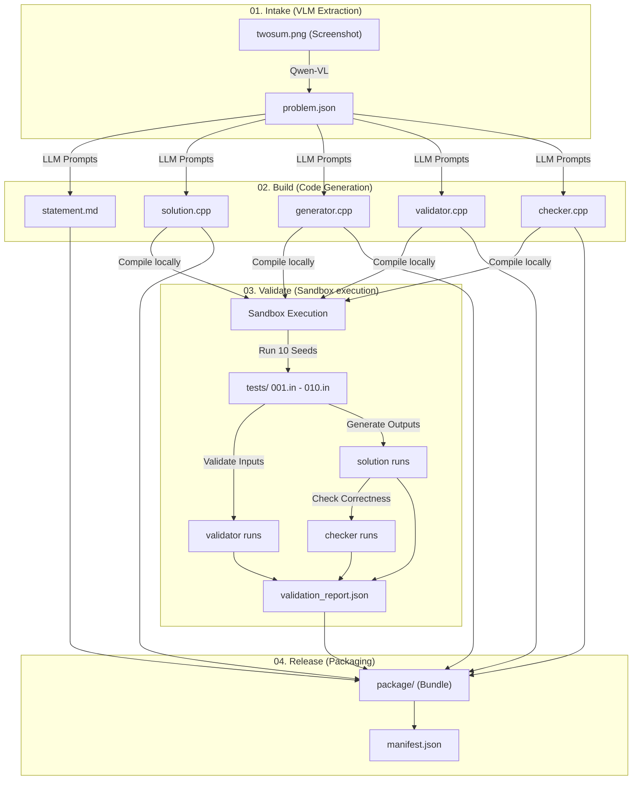

# AutoSetter — Two Sum Pipeline End-to-End Workflow Example

This folder demonstrates the exact end-to-end workflow of the AutoSetter pipeline using the classic **Two Sum** problem as an example.

It includes:
1. **Intake files** (Problem screenshot + generated `problem.json`)
2. **Build files** (Generated statement markdown + C++ solutions, validator, generator, checker)
3. **Validation files** (Outputs from sandbox compilations, test runs, and test validation reports)
4. **Release Package** (The clean packaged release bundle)

---

## The Workflow Diagram

Here is the workflow showing the four phases of AutoSetter:


---

## Step-by-Step Execution Walkthrough

Below is how the Two Sum problem moves through each stage of the AutoSetter pipeline:



---

### Step 1: Intake (Image Upload & Extraction)
* **Input**: A screenshot of the LeetCode problem ([twosum.png](01_intake/twosum.png)).
* **Process**: Qwen VLM extracts the text and structural details of the problem statement.
* **Output**: A structured [problem.json](01_intake/problem.json) file representing the problem spec:
```json
{
  "title": "Two Sum",
  "story": "You are given an array of integers nums and an integer target...",
  "input_format": "The first line contains two integers: n and target...",
  "output_format": "Print two space-separated integers representing the 0-based indices...",
  "constraints": "2 <= n <= 1000\n-10^9 <= nums[i] <= 10^9...",
  "samples": [...]
}
```

---

### Step 2: Build (LLM Code Generation)
* **Input**: The structured `problem.json` spec.
* **Process**: Using the 5 templates under `prompts/`, AutoSetter calls the LLM to generate the implementation files.
* **Output**: Files created in `02_build/`:
  - `statement.md` — The user-facing problem description.
  - `solution.cpp` — The reference $O(N)$ solution using a hash map.
  - `generator.cpp` — Generates random valid test cases using `testlib.h`.
  - `validator.cpp` — Validates generated inputs against constraints using `testlib.h`.
  - `checker.cpp` — Verifies solution output against expected outputs using `testlib.h`.

---

### Step 3: Validate (Sandbox & Testing)
* **Input**: The generated `.cpp` files in `02_build/`.
* **Process**: The validation engine:
  1. Downloads `testlib.h` into the compilation directory.
  2. Compiles `solution.cpp`, `generator.cpp`, `validator.cpp`, and `checker.cpp`.
  3. Runs the generator with 10 random seeds (1-10) to write input files (`001.in`, etc.).
  4. Runs the validator on each generated input.
  5. Runs the reference solution to generate jury outputs (`001.ans`, etc.).
  6. Runs the checker to ensure the outputs match the problem specification.
* **Output**: Files created in `03_validate/`:
  - `validation_report.json` — Status report of compilation, run times, and validation results.
  - Test inputs (`001.in`, etc.) and outputs (`001.ans`, etc.).

> [!NOTE]
> During validation in this example, test cases **7, 9, and 10** were flagged as invalid. The validator successfully caught that the generated `target` value fell outside the constraints of $[-10^9, 10^9]$ because the generator added two large values without checking bounds. This demonstrates the power of sandboxed validation in checking generator correctness!

---

### Step 4: Release (Packaging)
* **Input**: All build and validation artifacts.
* **Process**: The packager cleanses and arranges the directory structure.
* **Output**: Files packaged in `04_package/`:
  - `problem.json`, `statement.md`
  - `solutions/solution.cpp`
  - `files/` containing `validator.cpp`, `generator.cpp`, `checker.cpp`, and `testlib.h`
  - `tests/` containing all inputs (`.in`) and expected outputs (`.ans`)
  - `validation_report.json`
  - `manifest.json` — Listing all packaged files and test results.

---

## How to Run This Mock Pipeline Locally

Since Ollama is too heavy for laptops with smaller GPUs, you can run the mock pipeline script. It executes Stages 03 and 04 locally using the Two Sum C++ files:

```bash
python3 run_mock_pipeline.py
```
This script will compile the code, run the validator and generator test loops, and construct the release package dynamically.
