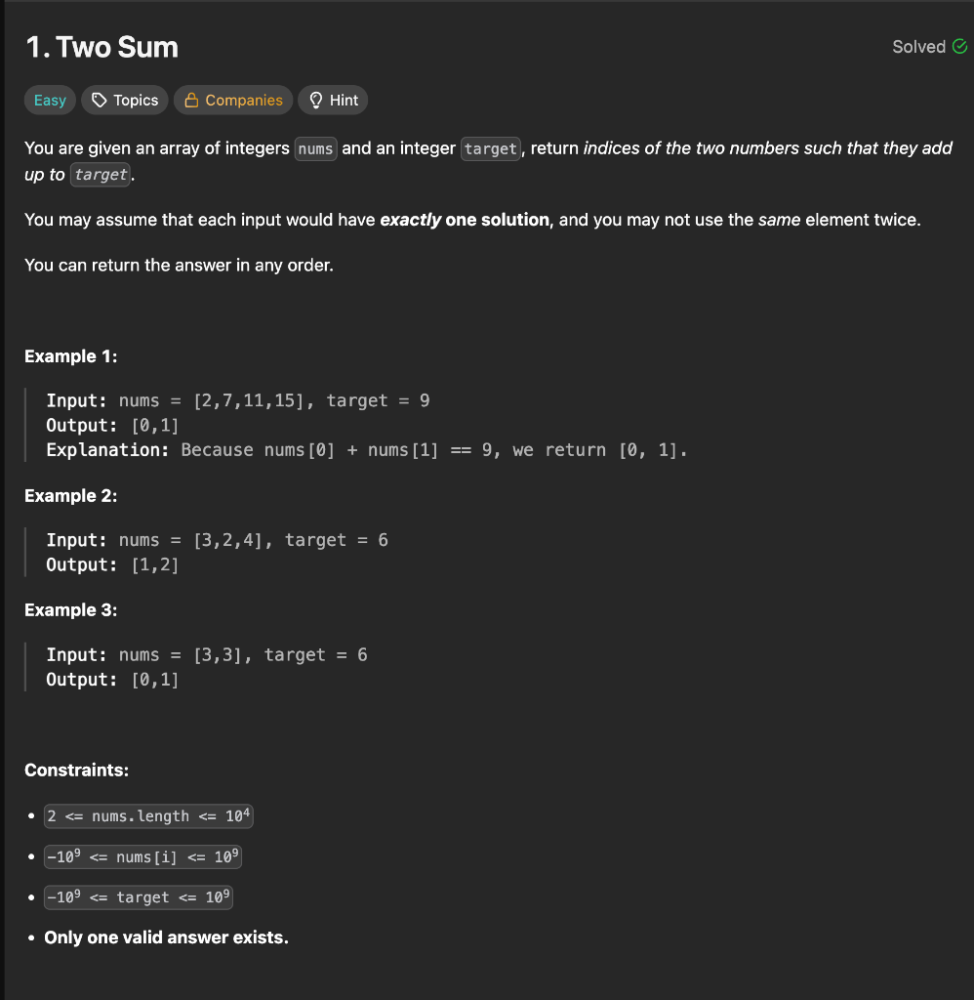
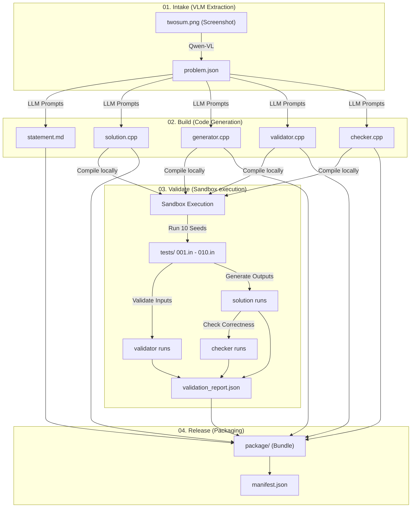

# AutoSetter — Two Sum Pipeline End-to-End Workflow Example

This folder demonstrates the exact end-to-end workflow of the AutoSetter pipeline using the classic **Two Sum** problem as an example.

It includes:
1. **Intake files** (Problem screenshot + generated `problem.json`)
2. **Build files** (Generated statement markdown + C++ solutions, validator, generator, checker)
3. **Validation files** (Outputs from sandbox compilations, test runs, and test validation reports)
4. **Release Package** (The clean packaged release bundle)

---

## The Workflow Diagram

Here is the workflow showing the four phases of AutoSetter:



---

## Step-by-Step Execution Walkthrough

Below is how the Two Sum problem moves through each stage of the AutoSetter pipeline:



---

### Step 1: Intake (Image Upload & Extraction)
* **Input**: A screenshot of the LeetCode problem ([twosum.png](01_intake/twosum.png)).
* **Process**: Qwen VLM extracts the text and structural details of the problem statement.
* **Output**: A structured [problem.json](01_intake/problem.json) file representing the problem spec:
```json
{
  "title": "Two Sum",
  "story": "You are given an array of integers nums and an integer target...",
  "input_format": "The first line contains two integers: n and target...",
  "output_format": "Print two space-separated integers representing the 0-based indices...",
  "constraints": "2 <= n <= 1000\n-10^9 <= nums[i] <= 10^9...",
  "samples": [...]
}
```

---

### Step 2: Build (LLM Code Generation)
* **Input**: The structured `problem.json` spec.
* **Process**: Using the 5 templates under `prompts/`, AutoSetter calls the LLM to generate the implementation files.
* **Output**: Files created in `02_build/`:
  - `statement.md` — The user-facing problem description.
  - `solution.cpp` — The reference $O(N)$ solution using a hash map.
  - `generator.cpp` — Generates random valid test cases using `testlib.h`.
  - `validator.cpp` — Validates generated inputs against constraints using `testlib.h`.
  - `checker.cpp` — Verifies solution output against expected outputs using `testlib.h`.

---

### Step 3: Validate (Sandbox & Testing)
* **Input**: The generated `.cpp` files in `02_build/`.
* **Process**: The validation engine:
  1. Copies `testlib.h` from `third_party/` into the compilation directory.
  2. Compiles `solution.cpp`, `generator.cpp`, `validator.cpp`, and `checker.cpp`.
  3. Runs the validator on the statement's official samples — a correct validator must accept every one.
  4. Runs the generator with 10 random seeds (1-10) to write input files.
  5. Runs the validator on each generated input.
  6. Runs the reference solution to generate jury outputs.
  7. Runs the checker on the jury's own answer (it must accept) and on deliberately broken outputs (it must reject).
* **Output**: Files created in `03_validate/`:
  - `validation_report.json` — compilation status, sample checks, checker probes, per-test results, and a one-line `diagnosis`.
  - Shippable test inputs (`001.in`) and outputs (`001.ans`), renumbered without gaps.
  - `rejected/` — inputs that did not survive, each with a `.why` file.

> [!NOTE]
> **This run passed 10/10 tests and is still not fit to release.** That is the most useful thing in this folder, so it is worth reading carefully.
>
> An earlier run of the same generator had three tests rejected: `target` fell outside $[-10^9, 10^9]$, because the generator computes `target = nums[i] + nums[j]` from two legal elements and never re-checks the result against `target`'s own bound. For two uniform values in $[-B, B]$, their sum leaves $[-B, B]$ exactly **25%** of the time — so the bug fires on roughly one test in four, and this run's arguments simply never rolled it. **The bug did not go away. "10/10 passed" was never evidence.**
>
> What the run does catch is that the generator **ignores its mode argument**. `min` describes exactly one input — every value at its smallest legal value — so asking for it twice with two different seeds must return identical bytes. It returned two different files, which proves the mode was never read, which means none of the shaped tests are shaped and no test deliberately reaches a stated bound. `manifest.json` reports `ready_for_release: false` and the report names the fix.
>
> The checker, by contrast, is probed with an empty output, a truncated answer, an extra token and a perturbed answer, and rejects all four, so it is recorded as trusted.
>
> When a test *is* rejected, the report attributes it rather than merely recording it: because the validator accepts the problem's official sample, the validator is the trustworthy party and the report names **the generator** as the file at fault. Rejected inputs are kept in `rejected/` with their reason and are never packaged — an input with no answer file is not a test.

---

### Step 4: Release (Packaging)
* **Input**: All build and validation artifacts.
* **Process**: The packager cleanses and arranges the directory structure.
* **Process**: The packager arranges the directory structure, copying only complete `.in`/`.ans` pairs.
* **Output**: Files packaged in `04_package/`:
  - `problem.json`, `statement.md`
  - `solutions/solution.cpp`
  - `files/` containing `validator.cpp`, `generator.cpp`, `checker.cpp`, and `testlib.h`
  - `tests/` containing the shippable inputs (`.in`) and expected outputs (`.ans`)
  - `validation_report.json`
  - `manifest.json` — packaged files, excluded tests, and `ready_for_release`.

> [!IMPORTANT]
> `ready_for_release` is the field to read first. A package that was *assembled* is not the same as a package that is fit to *upload*, and in this example it is `false`.

---

## How to Run This Mock Pipeline Locally

Since Ollama is too heavy for laptops with smaller GPUs, you can run the mock pipeline script. It executes Stages 03 and 04 locally using the Two Sum C++ files:

```bash
python3 run_mock_pipeline.py
```
This script will compile the code, run the validator and generator test loops, and construct the release package dynamically.
